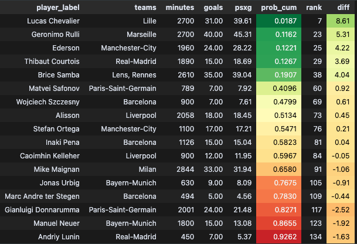

# goalkeepers

Un notebook pour montrer comment évaluer les arrêts d'un gardien

## Installation

```bash
uv venv .venv
uv sync
```

## Notebook

Le notebook est en python, à ouvrir avec **jupytext**.


